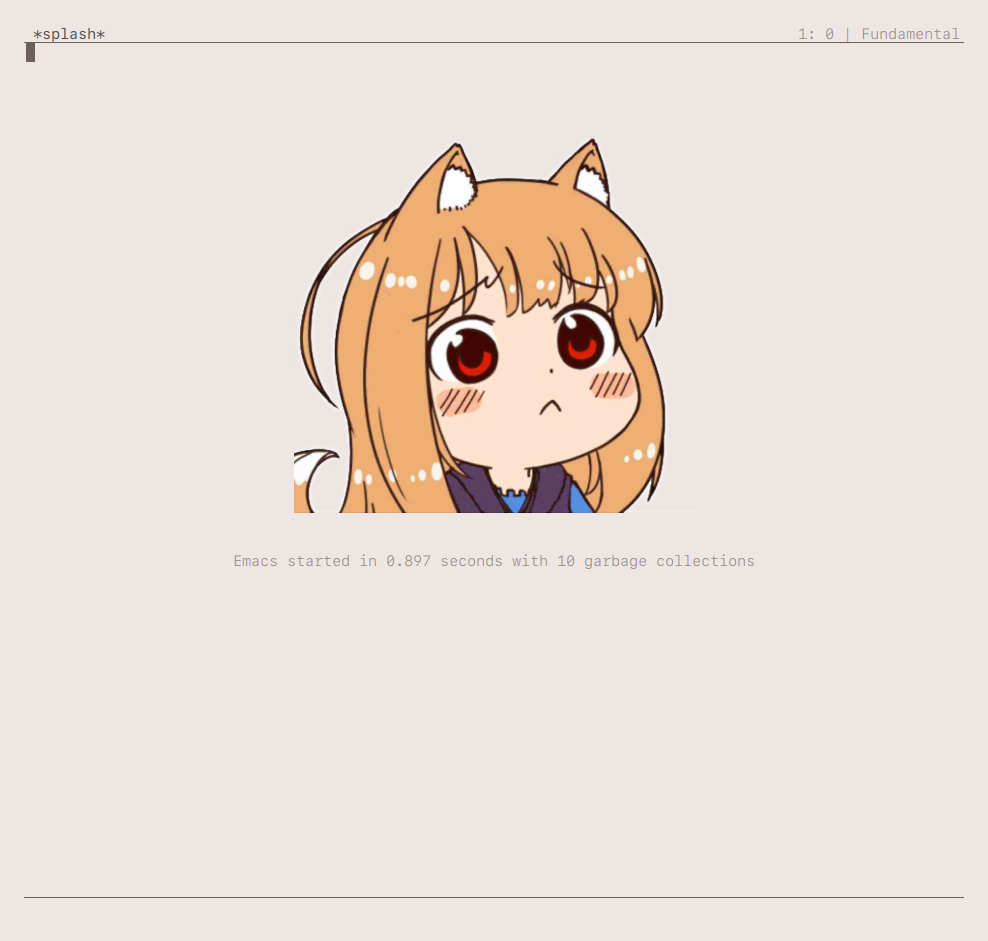
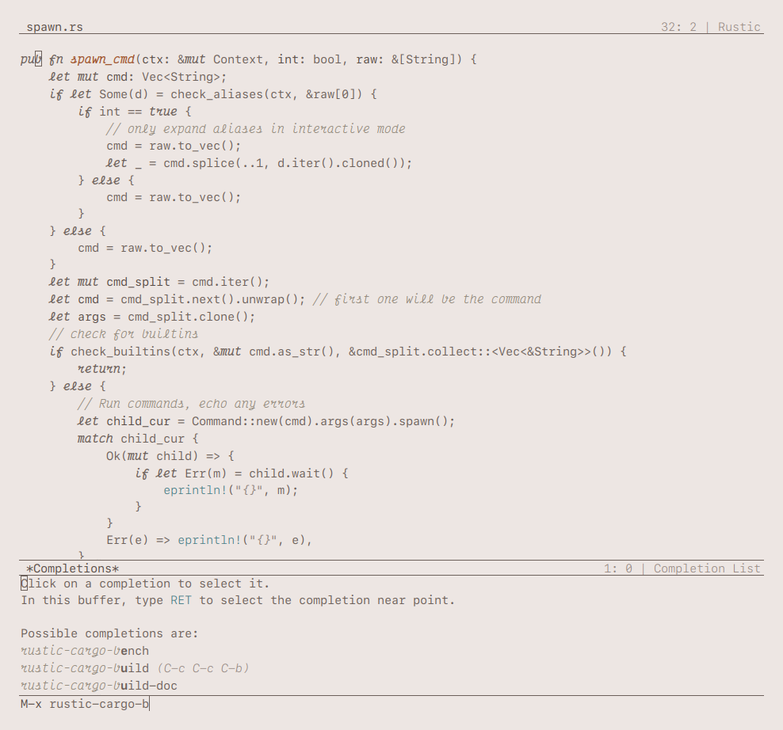
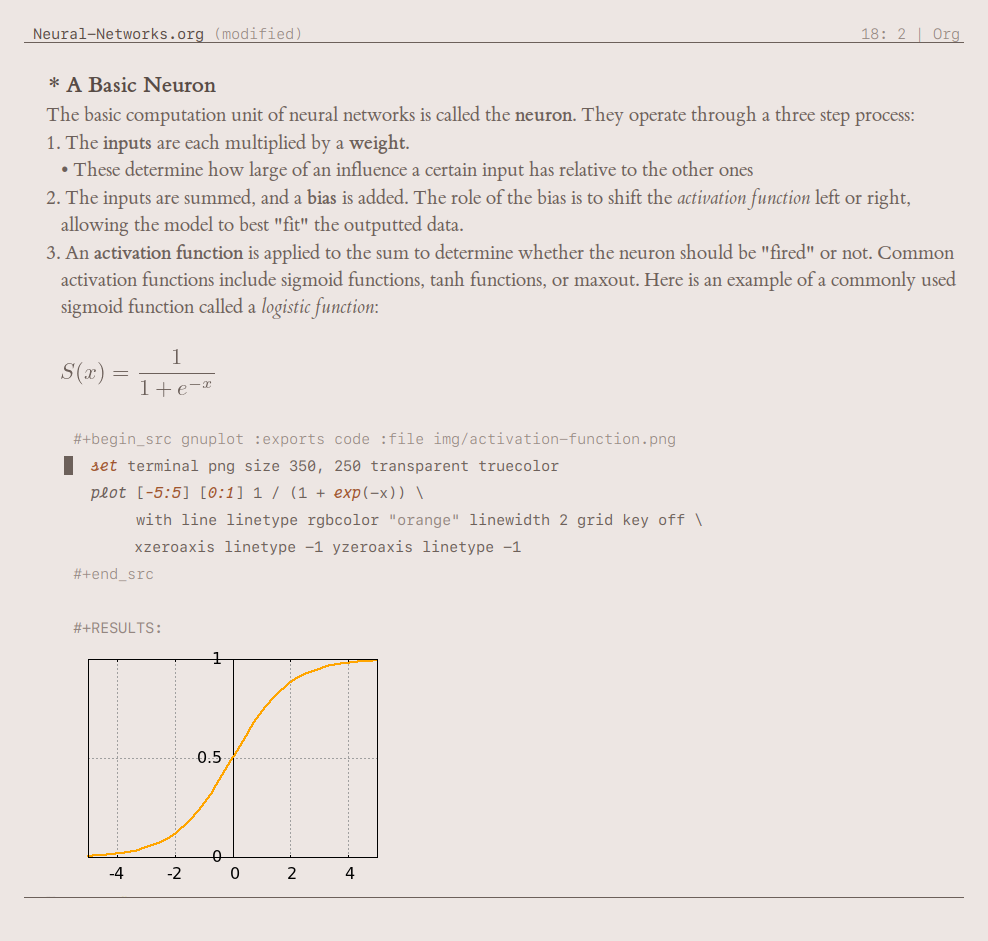
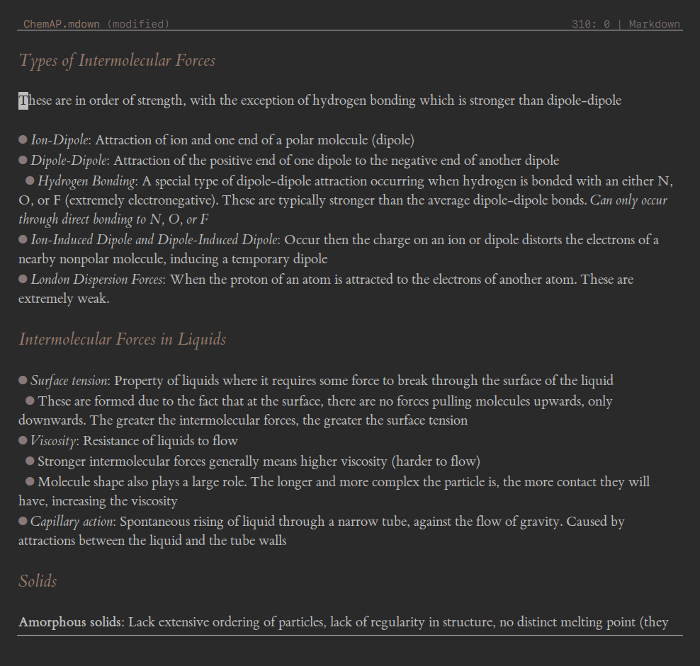

# Emacs Configuration

A fairly minimal, vanilla configuration for emacs. It was written mostly from scratch, though some code portions are taken/inspired by [elegant-emacs](https://github.com/rougier/elegant-emacs). 

## Previews

Click to show

 

### Splash Screen

### Code

### Org-mode

### Dark theme (editing markdown)

## Dependencies

There are no hard dependencies (except for emacs of course).

However, the scaling for different text sizes was written with the following fonts in mind:

- Fixed pitch font: SF Mono
- Variable pitch font: ETBembo (Cormodant Garamond is also supported)
- Italic font (for cursive italics): Victor Mono

If you don't have some of these installed, emacs will fallback to your default system values.

## Usage

1. Copy the files to `~/.emacs.d` or `~/.config/emacs`
2. *Clear everything in the `lisp/custom-ops.el` file*, **expect the last line** (leaving only `(provide 'custom-ops)`).
  - This file contains all custom configuration options set with `M-x customize` and also configuration for everything *not* in vanilla emacs (eg: plugins).
  - Unless you use the exact same plugins I do, you probably want to clear my settings. Otherwise emacs will complain about missing plugins

### Optional Steps

**If you want to install packages:**

- The Melpa and GNU Elpa package sources are initialized by default
- To get packages, use the builtin package.el: `M-x package-refresh-contents`, then the usual commands such as `M-x package-install` to install.
- To prevent unwanted network requests, the config *does not* run `package-refresh-contents` automatically. You will need to run it manually when you want to refresh the package list.

**Default theme is light theme. If you want dark theme:**

- Dark theme function is called `sayo`, and light theme function is called `blossom`. These are set near the bottom of the `init.el` file. Change it to set the default theme.
- To toggle theme on the fly, use `M-x theme-toggle`

**If you want custom splash images:**

- An image is randomly chosen from the `data/splash-img` directory on emacs startup. Change the images in this directory to display them on the splash screen.
- The names of the files do not matter, and you can use any image file type supported by your build of emacs.

**If you want to customize some options:**

- Use `M-x customize` for interactive customization. Your custom options will be stored in `lisp/custom-ops.el`.
- Or just edit any of the files directly. You don't need black magic or anything :)